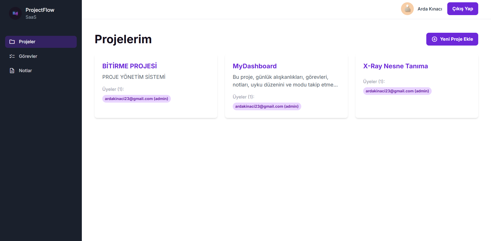

# 🚀 AI Destekli Proje Yönetim Sistemi

**YMH455 Bitirme Projesi**

Bu proje, takımların iş süreçlerini organize etmesini sağlayan modern bir web uygulamasıdır. İçerisinde bulunan **Google Gemini (Yapay Zeka)** entegrasyonu sayesinde projeleri analiz eder ve yöneticilere akıllı öneriler sunar.

## 🌟 Temel Özellikler

* **🤖 AI Analiz:** Proje verilerini analiz edip risk ve öneri raporu sunan yapay zeka asistanı.
* **📋 Kanban Panosu:** Sürükle-Bırak ile yönetilen interaktif görev takip sistemi.
* **📊 İstatistikler:** Proje ilerleme durumunu gösteren grafikler.
* **🔐 Güvenlik:** JWT tabanlı güvenli giriş ve rol bazlı yetkilendirme (Admin/Üye).
* **📝 Notlar:** Kişisel not defteri modülü.

## 🛠️ Teknolojiler

* **Frontend:** React.js, Vite, Tailwind CSS, Recharts
* **Backend:** Python, FastAPI, PostgreSQL, SQLAlchemy
* **Yapay Zeka:** Google Gemini API

## 📸 Ekran Görüntüsü

---
**Geliştirici:** Göktan Arda Kınacı